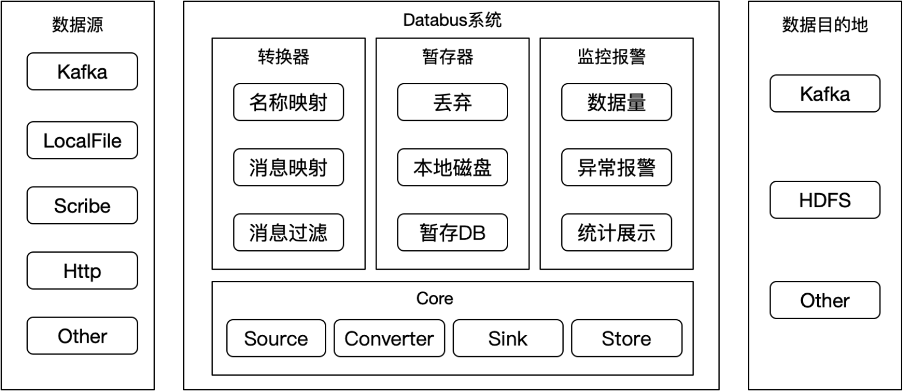
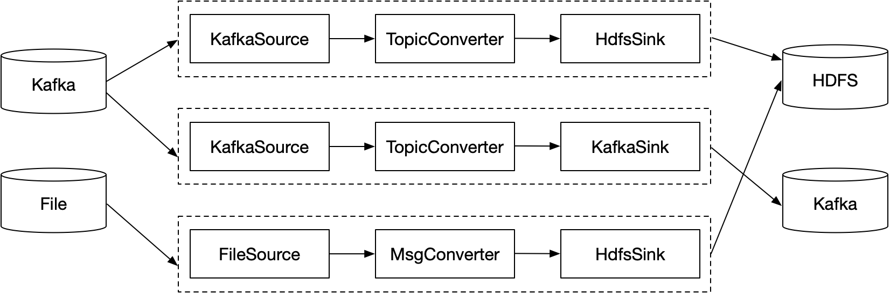

# 分布式日志传输系统 Databus

Databus是一个分布式、高可用的，用于采集和移动大量日志数据的服务。 它是基于流式数据的简单而灵活的架构，具备健壮性和容错性，具有故障转移与恢复机制。 它采用简单的可扩展的数据投递模型，允许用户自定义扩展传输组件。

## 主要特性

* <font color=orange>**All-In-One**</font> 所有的日志传输通道整合到一个系统，避免针对每种业务相应地定制一套日志传输组件，这样随着业务的增多，运维压力会剧增。
* <font color=orange>**热加载**</font> 在JVM无需重启的情况下，可以添加、更新、删除指定的日志传输通道，且不会影响到其他传输通道的正常工作。
* <font color=orange>**容错性**</font> 对于Databus分布式系统，若出现少量传输节点异常崩溃，那么异常崩溃节点的数据流量会切至其他节点，不影响整个系统的正常运行。

## 系统架构

Databus系统可对接多种数据源和数据目的地，将数据源的日志同步到数据目的地。常用的数据源有：Kafka、本地文件、ScribeClient等，常用的数据目的地有：Kafka、HDFS等。

Databus系统的核心处理模块包含四部分：Source、Converter、Sink、Store。Source模块负责收集数据源的日志，Converter模块负责对日志转换，如：重命名Topic名称、对消息体的ETL和过滤，Sink模块负责把日志同步到数据目的地，Store模块负责把写入数据目的地失败的日志暂存起来，根据策略进行后续的处理。

Databus系统的监控报警模块主要包含：数据量统计、灵活的Exporter插件、异常报警。数据量统计用于统计Source端的读取量和Sink端的写入量，便于全链路的数据对账。系统暴露了Exporter接口，用户只需针对特定的存储系统实现相应的Exporter,即可把监控信息采集过去，配置图表后做直观的展示。
另外若日志写入数据目的地失败，可通过配置策略发送报警。



## 数据流模型

Databus系统的数据流模型设计为一个Source对应一个Sink，一个Source和与其对应的Sink组成一个Pipeline管道，各个Pipeline相互独立、互不影响。通过这种Pipeline模型，用户新增、删除、变更某个Pipeline，不会影响到其他Pipeline的数据传输，且使用热部署的方式不需要重启进程。
做到尽可能少的中断数据流，保障日志传输的实时性。



## 安装部署

### 编译
```shell
git clone https://github.com/weibodip/databus.git
cd databus
mvn clean package -DskipTests
```

### 初始化环境

```shell
mkdir -p /data0/workspace
mv ../databus /data0/workspace
mkdir /var/log/databus/
```

### 添加配置
可以在 /data0/workspace/databus/pipelines 目录下添加多个配置文件，每个配置文件抽象为一个 pipeline，各个 pipeline 的日志传输互相独立，互不干扰。
这里以读取本地文件的日志记录，并写入 kafka topic 的 pipeline 配置为例。
```shell
vim /data0/workspace/databus/pipelines/file-to-kafka-example.properties
pipeline.name=file-to-kafka-example

pipeline.source=com.weibo.dip.databus.source.FileSource
pipeline.converter=com.weibo.dip.databus.converter.TopicNameConverter
pipeline.store=com.weibo.dip.databus.store.DefaultStore
pipeline.sink=com.weibo.dip.databus.sink.KafkaSinkV010

#source
source.file.directory=/data0/log/databus/test/
source.file.include.pattern=^.*\\.test\\.log$
source.file.category=test
source.file.delete.after.read=true
source.file.retention.second=7200

#converter
topic.mappings=test:test

#sink
sink.kafka.bootstrap.servers=hostname1:9092,hostname2:9092,hostname3:9092
sink.kafka.key.serializer=org.apache.kafka.common.serialization.StringSerializer
sink.kafka.value.serializer=org.apache.kafka.common.serialization.StringSerializer
```


### 启停操作

系统默认的JDK路径：/usr/local/jdk1.8.0_144，可根据情况修改 bin/databus-server.sh 的 JAVA_HOME。

```shell
# 启动
/data0/workspace/databus/bin/databus-server.sh start

# 查看运行状态
/data0/workspace/databus/bin/databus-server.sh status

# 查看日志
tailf /var/log/databus/server.log

# 停止
/data0/workspace/databus/bin/databus-server.sh stop
```

## 配置

### Sources
* [FileSource](docs/FileSourceProps.md)
* [KafkaSourceV010](docs/KafkaSourceV010Props.md)


### Sinks
* [ScribeSink](docs/ScribeSinkProps.md)
* [KafkaSinkV010](docs/KafkaSinkV010Props.md)


### Converters
* [TopicNameConverter](docs/TopicNameConverter.md)


### Pipeline 示例
* [FileSource2ScribeSink](docs/FileSource2ScribeSink.md)


## 与 Flume 对比

Flume 的模型抽象上有 Channel 的概念，这样便于多路复用数据流，其常见的场景：
* 一个 source 复制到多个 channel
* 制定规则将一个 source 拆分到多个 channel

Flume 的多路复用数据流，增加了数据处理的灵活性，但是常用的 Channel 也存在一些问题：
* FileChannel 会降低数据写入和读取速度。
* MemoryChannel 增加对服务器内存的占用，数据传输通道过多时甚至会导致进程的OOM。
* KafkaChannel 浪费一部分的带宽资源；且引入额外组件，会导致传输链路变长，降低服务稳定性。  

考虑到 Channel 在目前的实现上存在一些问题，去掉 Channel 在一些不需要多路复用数据流的场景下，表现效果会更好。
Databus 的设计理念在于去掉 Channel，其相比 Flume 的优势在于：
* 模型抽象简单，方便理解，一个 source 对应一个 sink。
* 配置项简单，对于数十行的 Flume 配置，Databus 可能只需十几行即可搞定。
* 数据传输延迟低，去掉 Channel 组件，缩短了数据链路，尤其对于非内存的 Channel，降低数据延迟的效果更明显。


|  | Flume | Databus |
| :--- | :--- | :--- | 
| 模型抽象 | source-channel-sink | source-sink|
| 配置 | 繁多冗长 | 简洁|
| 灵活性 | 一个source对应多个sink | 一个source对应一个sink |
| 数据传输延迟 | 较高 | 较低 |

